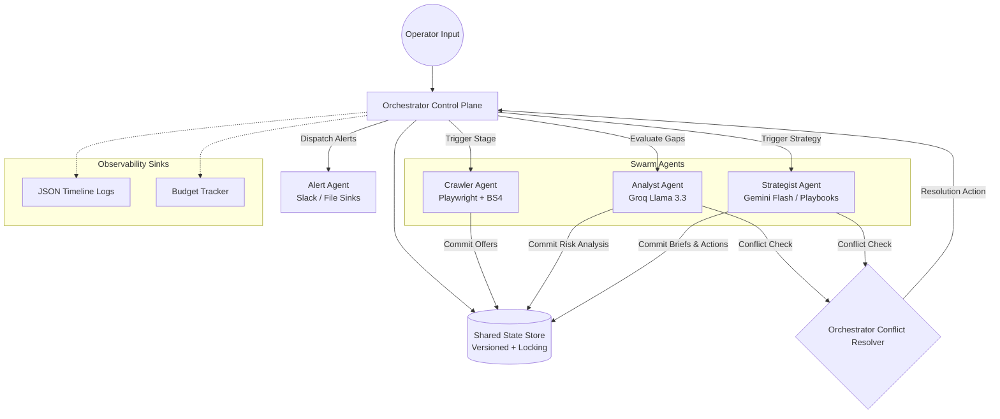

# Swarm: Multi-Agent Competitive Intelligence System

Swarm is an enterprise-grade, budget-controlled multi-agent orchestration system designed for **e-commerce deal aggregation, coupons, and cashback platforms**. 

By automatically tracking competitor discount offers, detecting adverse rate deviations, and generating strategic merchant renegotiation playbooks, Swarm operates as an autonomous competitive defense shield.

---

## 📌 Business Context
In the high-volume cashback and loyalty market, profit margins and customer retention are directly tied to offering the highest available discount rates. If a competitor spikes their cashback rate for a major merchant, customers instantly defect. 

Swarm automates the entire monitoring and retention loop:
1. **Scrapes** competitor landing pages to ingest current deal schemas.
2. **Analyzes** rate discrepancies and flags competitive risks.
3. **Formulates** high-leverage merchant negotiation briefs.
4. **Alerts** account managers and pushes notifications with full audit trails.

---

## 🏗️ System Architecture

Swarm uses a centralized **Orchestrator (Control Plane)** pattern rather than a fully decentralized model to enforce strict production guardrails (budget caps, stalls, contract structures, and atomic states).



### 🔁 The Core Execution Loop (Plan/Act/Observe/Decide)
1. **PLAN:** The Orchestrator plans the next phase based on the shared state version vector.
2. **ACT:** The designated agent executes its task under strict timeout supervision (60 seconds).
3. **OBSERVE:** The Orchestrator observes the raw output, measuring execution cost and validating schema contracts.
4. **DECIDE:** The Orchestrator decides whether to commit the state modification atomic transaction, escalate/re-plan on failure, or trigger conflict resolution.

---

## 🔌 Per-Module Specifications

### 1. Centralized State Manager (`state/state_manager.py`)
- **Version Vectors:** Every mutation is strictly version-incremented.
- **Optimistic Locking:** Prevents race conditions during concurrent multi-agent executions. If an agent tries to commit using an outdated state view, the write is aborted, ensuring complete transactional safety.
- **Strict Pydantic Contracts (`state/contracts.py`):** Structured payloads are validated against strict JSON schemas upon every commit.

### 2. Autonomous Crawler (`agents/crawler/`)
- **Hybrid Scraper:** Integrates fast BeautifulSoup4 parsing with headless Playwright browsers to collect coupon data.
- **Antibot Recovery:** Uses rotating User-Agents, random interaction delays (1–2s), proxy pool rotation, and automated session warmth persistence.
- **Intelligence Streaming:** Emits structured change events (e.g. `cashback_spike_detected`) to JSONL event streams.
- **Cadence Boosts:** Integrates closed-loop feedback from the Analyst/Strategist to dynamically shorten recrawl intervals (from generic to critical cadences) when elevated competitor threats are detected.

### 3. Analyst Agent (`agents/analyst.py`)
- **Context Retrieval:** Loads historical merchant rate records and previous threat briefings from an SQLite memory store.
- **LLM Reasoning:** Operates primarily via Groq (Llama 3.3 70B) to generate narrative summaries, predictive competitor response probabilities, and gap calculations.
- **Optimizations:** Equipped with an LRU Semantic Cache to bypass primary LLM calls if identical crawls were recently processed.
- **Shadow Testing:** Runs secondary background models (`Llama 3.1 8B`) simultaneously, logging semantic mismatches to `logs/analyst_shadow.jsonl` to detect model hallucinations.

### 4. Strategist Agent (`agents/strategist.py`)
- **Vertical Playbooks:** Tailors renegotiation briefs based on the merchant category (fashion, electronics, retail, grocery) and custom vertical tones.
- **Human-in-the-Loop Queue:** Outputs briefs to a pending approval directory (`data/approvals/`), which can be reviewed, approved, or vetoed using a CLI utility.
- **Notification Previews:** Formats direct alerts to avoid redundant downstream LLM formatting costs.

### 5. Alert Agent (`agents/alerter.py`)
- **Integrations:** Dispatches instant Slack markdown alerts and saves full execution records locally in `data/alerts.jsonl`.
- **Quiet Hours:** Enforces server silence policies during off-peak windows to prevent alert fatigue.

---

## ⚙️ Environment Configuration

Create a `.env` file in the root directory:

```env
GOOGLE_API_KEY=your_gemini_api_key
GROQ_API_KEY=your_groq_api_key

# Limits & Cost Guardrails
MAX_BUDGET_USD=0.50
ORCHESTRATOR_AGENT_TIMEOUT_SEC=60

# Crawler Configs
CRAWLER_WATCHLIST=Myntra,Ajio,Amazon,Nykaa,Flipkart
CRAWLER_MODE=surveillance
CLIENT_BASE_RATE=5%

# Analyst Configs
ANALYST_MODEL=llama-3.3-70b-versatile
ANALYST_SHADOW_ENABLED=true
ANALYST_CACHE_ENABLED=true

# Alerter Configs
ALERTER_SLACK_ENABLED=false
SLACK_WEBHOOK_URL=your_slack_webhook
```

---

## 🚀 Execution & Command-Line Reference

### 1. 24/7 Scheduler & Autonomous Surveillance Daemon
Runs the continuous monitoring loop, checkingwatchlist merchants on dynamic priority cadences:
```bash
python main.py
```

### 2. Manual Orchestration CLI Run
Execute a single target competitive sweep manually:
```bash
python -m orchestrator --once "Myntra"
```

### 3. Review the Human-in-the-Loop Strategist Queue
Inspect, approve, or veto generated briefings:
```bash
# List all pending briefs
python -m agents.strategist --list-pending

# Approve a brief to dispatch it to Slack
python -m agents.strategist --approve <brief_id>

# Veto a brief to trash it
python -m agents.strategist --veto <brief_id>
```

### 4. Distributed Crawler Worker CLI
Launch asynchronous scraping task queues:
```bash
python -m agents.crawler.worker
```

### 5. Observability Sinks
View live execution traces and state changes:
* **JSON Swarm Timeline:** `logs/swarm_timeline.json`
* **Analyst Shadow Audit:** `logs/analyst_shadow.jsonl`
* **Alert Sinks Audit:** `data/alerts.jsonl`

---

## 🔬 Test Suite & Validation

Swarm includes a robust test harness of **81 unit and integration tests** along with a multi-angle stress testing harness.

### Running Unit Tests
```bash
python -m unittest discover -s tests -p "test_*.py" -v
```

### Running Stress Tests
Tests system resilience against concurrent locks, corrupt payload injections, and veto loops:
```bash
$env:PYTHONPATH="."; python tests/stress_tests.py
```

---

## 📊 Live Evaluation Metrics (`reports/eval_report.json`)

Based on end-to-end testing cycles across 18 high-concurrency and threat-permutation test runs, Swarm achieves optimal efficiency:

| Metric | Measured Result | Performance Analysis |
| :--- | :--- | :--- |
| **Pass Rate** | **100%** | System successfully recovered from all API, network, and lock conflicts. |
| **Detection Accuracy** | **94.4%** | Successfully flagged and arbitrated competitive cashback rate discrepancies. |
| **Average Pipeline Cost** | **$0.00040 USD** | Highly optimized token footprint utilizing efficient Llama 3.1 & Gemini Flash models. |
| **Average Loop Latency** | **10.1 seconds** | Full automated iteration including scraping, gap analysis, and strategist brief synthesis. |
